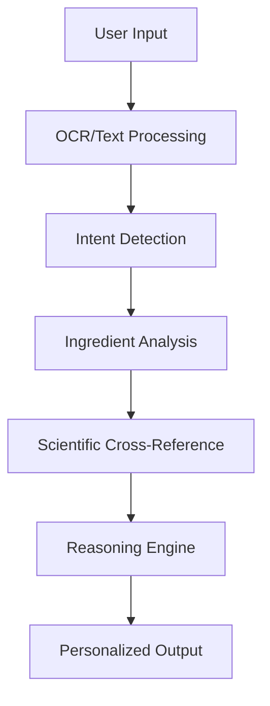

# Tattva - AI-Native Food Label Analysis

<div align="center">
  

  
  <p align="center">
    <strong>AI-native reasoning for your food labels.</strong>
  </p>
  
  <p align="center">
    <em>Reveal the truth behind the label with our AI-powered food analysis tool.</em>
  </p>
</div>

---

An AI-powered web application that transforms how consumers understand food labels. Built with **React**, **Tailwind CSS**, and **Gemini AI**, Tattva uses cutting-edge reasoning to decode complex ingredient lists and provide personalized health insights.


---

## 📋 Table of Contents

- [📸 Screenshots](#-screenshots)
- [🌟 About the Project](#-about-the-project)
- [✨ Features](#-features)
- [🤖 AI Technology](#-ai-technology)
- [💻 Tech Stack](#-tech-stack)
- [🚀 Getting Started](#-getting-started)
- [📂 Folder Structure](#-folder-structure)
- [🧠 How It Works](#-how-it-works)
- [👥 Project Team](#-project-team)
- [📜 License](#-license)

---

## 📸 Screenshots

<div align="center">
  
  <p><em>Home screen with input options for food label analysis</em></p>
</div>

<div align="center">
  
  <p><em>AI processing interface with real-time progress updates</em></p>
</div>

<div align="center">
  
  <p><em>Analysis results with clear verdict and key findings</em></p>
</div>

<div align="center">
  
  <p><em>Detailed ingredient breakdown with risk assessments</em></p>
</div>

---

## 🌟 About the Project

**Tattva** is an AI-native web application designed to bridge the information gap in food labeling. Traditional food labels are optimized for regulatory compliance, not human understanding, leaving consumers confused about what they're actually eating.

Our solution uses advanced AI reasoning to:
- Decode complex ingredient lists and chemical names
- Provide personalized health insights based on individual needs
- Explain trade-offs and uncertainty honestly rather than pretending certainty
- Reduce cognitive load at the moment of decision

> "We don't just act as a database lookup. Tattva acts as a reasoning engine that infers intent and explains only what matters."

### 🎯 Goals:
- Democratize food label understanding through AI
- Reduce cognitive overload when making food decisions
- Provide honest, science-backed insights about food products
- Create an intuitive, accessible interface for all users

---

## ✨ Features

- 🧠 **Intent-First Design** - Automatically detects what users care about without forms or filters
- 📸 **Multiple Input Methods** - Upload food label images or paste ingredient lists directly
- ⚡ **Real-time Analysis** - Watch as AI processes your food with progress indicators
- 🎯 **Clear Verdicts** - Get instant recommendations (Buy, Use Caution, Avoid) with confidence levels
- 📊 **Detailed Breakdowns** - Explore comprehensive ingredient analysis with risk assessments
- 📱 **Fully Responsive** - Optimized for both mobile and desktop experiences
- 🔄 **Cross-referencing** - AI analyzes ingredients against scientific databases and health guidelines
- 💚 **Honest Uncertainty** - Acknowledges when science is mixed rather than pretending certainty

---

## 🤖 AI Technology

### Reasoning Engine Architecture

Tattva's AI is built on a multi-layered reasoning approach:

1. **Intent Inference** - Automatically detects user concerns (allergies, additives, general health)
2. **Ingredient Analysis** - Decodes chemical names and evaluates health impacts
3. **Contextual Reasoning** - Explains trade-offs and uncertainty honestly
4. **Personalized Insights** - Provides recommendations based on individual needs

### Data Processing Pipeline

```
Input → OCR/Text Processing → Intent Detection → Ingredient Analysis → 
Scientific Cross-Reference → Reasoning Engine → Personalized Output
```

---

## 💻 Tech Stack

| Layer | Technologies |
|-------|---------------|
| **Frontend** | React.js |
| **Styling** | Tailwind CSS |
| **AI Backend** | Google Gemini API |
| **Image Processing** | OCR Technology |
| **Icons** | Lucide React |
| **Routing** | React Router |
| **State Management** | React Hooks |
| **Build Tool** | Vite |
| **Deployment** | Vercel / Netlify |

---

## 🚀 Getting Started

To run the project locally:

### Prerequisites

Ensure you have **Node.js (v16+)** and **npm** or **yarn** installed.

### Installation

```bash
# Clone the repository
git clone https://github.com/yourusername/tattva.git

# Navigate into the folder
cd tattva

# Install dependencies
npm install

# Set up environment variables
cp .env.example .env
# Add your Gemini API key to .env file

# Start the development server
npm run dev
```

Now open your browser at **[http://localhost:5173/](http://localhost:5173/)**

---

## 📂 Folder Structure

```bash
tattva/
│
├── public/
│   ├── images/
│   │   ├── team/          # Team member photos
│   │   └── samples/       # Sample food labels
│   └── favicon.ico
│
├── src/
│   ├── api/
│   │   └── gemini.js      # Gemini API integration
│   │
│   ├── components/
│   │   ├── common/
│   │   │   ├── Navbar.jsx      # Navigation component
│   │   │   └── Loading.jsx    # Loading states
│   │   ├── Input.jsx           # Food input component
│   │   ├── Thinking.jsx        # AI processing animation
│   │   └── Result.jsx          # Results display component
│   │
│   ├── pages/
│   │   ├── Home.jsx            # Main application page
│   │   └── About.jsx           # About page with team info
│   │
│   ├── App.jsx                  # Main app component
│   ├── main.jsx                 # ReactDOM root
│   ├── index.css                # Global styles
│   └── vite.config.js           # Vite configuration
│
├── .gitignore
├── package.json
├── tailwind.config.js
└── README.md
```

---

## 🧠 How It Works

### User Journey

1. **Input** - Users upload a food label image or paste an ingredients list
2. **Processing** - AI analyzes ingredients and cross-references with scientific databases
3. **Results** - Users receive a clear verdict with confidence level and key findings
4. **Deep Dive** - Optional detailed analysis with ingredient breakdowns and personalized recommendations

### AI Analysis Process



---

## 👥 Project Team

<div align="center">
  <table>
    <tr>
      <td align="center" width="150"><strong>Ayush Awasthi</strong></td>
      <td>Full Stack Developer & AI Engineer</td>
      <td>Led the full-stack development and AI integration for the reasoning engine</td>
    </tr>
    <tr>
      <td align="center"><strong>Atharv Dubey</strong></td>
      <td>Backend & ML Engineer</td>
      <td>Developed the backend infrastructure and machine learning pipelines</td>
    </tr>
    <tr>
      <td align="center"><strong>Aditya Srivastava</strong></td>
      <td>Full Stack Developer</td>
      <td>Implemented the frontend components and user interface</td>
    </tr>
    <tr>
      <td align="center"><strong>Ashish Shukla</strong></td>
      <td>Backend & ML Engineer</td>
      <td>Worked on data processing and model optimization</td>
    </tr>
  </table>
</div>

---

## 🏆 Achievements & Recognition

- 🥇 **ENCODE 2026 Hackathon** - Developed for the "Designing AI-Native Consumer Health Experiences" challenge
- 📊 **50% Judging Weight** - AI-Native design was a primary evaluation criterion
- 👥 **2000+ Participants** - Competed against teams from around the world
- 🌟 **Featured Project** - Recognized for innovative approach to food transparency

---

## 📜 License

This project is licensed under the **MIT License** — see the [LICENSE.md](LICENSE.md) file for details.

---

<div align="center">
  <p>Made with ❤️ for ENCODE 2026</p>
  <p>Designed to make food transparency accessible to everyone.</p>
</div>

---

[🔝 Back to Top](#-table-of-contents)
